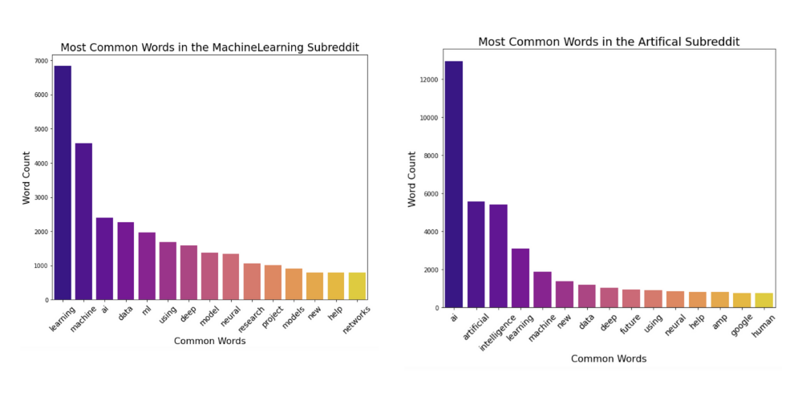
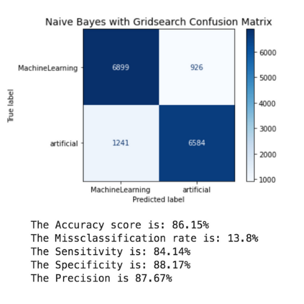
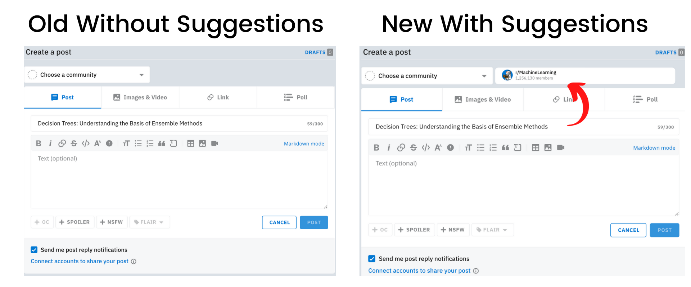

# Subreddit Recommendation System

Aidan Curley | US-DSIR-720 | 08.28.2020

## Problem Statement  

According to Reddit’s blog they had 199 million posts in 2019 alone and approximately 138,000 active subreddits. With so much information, how do they make sure people are posting in the right subreddits? Well they don't. So, how can we ensure that posts are going into the proper subreddit’s? Through a recommendation system!

## Table of Contents

- [Project Directory](#projectdirectory)
- [Executive Summary](#executivesummary)
- [Data](#data)
- [Modeling Process](#modellingprocess)
- [Production Model](#productionmodel)
- [Conclusions & Recommendations](#c&r)
- [Future Steps](#futuresteps)
- [Citations](#cite)


<a name="projectdirectory"></a>
## Project Directory
    
```
project_3-master
|__ assets 
|   |__ naive_bayes_gs_cm.png
|   |__ old_new.png
|   |__ wordcount_graphs.png
|__ code       
|   |__ 01_get_data.ipynb  
|   |__ 02_baseline_score.ipynb  
|   |__ 03_title_only.ipynb  
|   |__ 04_title_selftext.ipynb
|   |__ 05_lstm_rnn.ipynb  
|__ data  
|   |__ data_ai.csv  
|   |__ data_ml.csv  
|__ SubredditRecommendationSystem.pdf  
|__ README.md  

```

<a name="executivesummary"></a>
## Executive Summary

As Reddit continues to grow so do the chances of posting in the wrong subreddit's. One or two posts in the wrong subreddit's are not a problem but when Reddit is averaging more than 16 million posts a month there is a lot of room for error. So how does reddit make sure posts are going in the right subreddit? They don't. The user has to specify the specific subreddit that post should belong to or if the person posts in the wrong subreddit, usually people in that subreddit direct them to the proper subreddit for their post.
  
So what's the solution to this problem? A way to reduce the likelihood of human error when selecting a subreddit is if Reddit had a recommendation system that as you are writing your reddit post it says with a certain amount of accuracy which subreddit that post should belong to. Implementing this could reduce the amount of posting in the wrong subreddit which could lead to cleaner subreddit's and potentially more targeted advertising within these subreddit's.   

For this project I chose the two subreddits r/MachineLearning and r/artificial because these topics have a lot of overlapping content. Picking subreddit's that were similar in content was important because if I can achieve a high enough accuracy on two very closely related topics I believe this concept can be applied to all of the subreddits. I will use Natural Language Processing and a variety of classification machine learning models such as logistic regression, naive bayes, and an LSTM RNN to classify a post to either be in the r/MachineLearning subreddit or the r/artificial subreddit. I will evaluate each of these models based on their accuracy scores. I chose a handful of models to see how the accuracy score improves as model complexity increases.  

My best accuracy score so far was 86.15%. With this accuracy score on two subreddits that are very similar in topic I am confident in moving forward with this project and moving on to the next steps. The next steps consist of creating this same process but for every subreddit on Reddit.


<a name="data"></a>
## Data 

The data I am using for this project consists of a total of 31,299 posts from each subreddit which is 62,598 posts in total.  From these posts I only used the 'title'(the title of the post) and the 'selftext'(the content within the post) columns. I used the [pushshift api](https://github.com/pushshift/api) to scrape this data from reddit. For these two subreddits there were a couple cleaning steps that had to be addressed. In the 'selftext' column there were a lot of NaN values and removed/deleted posts. My way around these issues were replacing those values with a space so my models can still use that data. 

<a name="modellingprocess"></a>
## Modeling Process  

After bringing in the data I moved onto the modeling process.

After performing the common natural language processing tasks such as removing stop words, numbers, special characters and tokenizing the data I am finally able to model the data. 

Before moving onto modeling the data I wanted to see the most common words in each subreddit after cleaning the data. These were the 15 most common words in each subreddit:

  

As we can see in these charts there were a lot of overlapping words that seemed to play a role in deciding which subreddit a post belonged to. I will keep an eye on these words while modeling and decide later on if I should remove some of these words or not since there is a lot of overlap.

The metric I am scoring the models on is accuracy. Before getting the accuracy for the more complex models I had to get the baseline accuracy score. This baseline score was 50% since I had perfectly balanced classes.

I did one set of modeling for just the 'title' column and another set of modeling for the 'title' and 'selftext' columns together. I wanted to see if adding the 'selftext' column increased my model's accuracy, made it stay the same, or made the accuracy score decrease. 

**Title Only Model & Accuracy:**
- Simple Logistic Regression had an accuracy score of 80.79% 
- Logistic Regression with Gridsearch had an accuracy score of 80.97%
- Multinomial Naive Bayes with Gridsearch had an accuracy score of **86.15%**

**Title and Selftext Model & Accuracy:**
- Simple Logistic Regression had an accuracy score of 80.46%
- Logistic Regression with Gridsearch had an accuracy score of 80.09%
- Multinomial Naive Bayes with Gridsearch had an accuracy score of 82.43%

Since the models did not improve from adding the 'selftext' columns I will not continue to use them with these two subreddits. However, I expect the 'selftext' column to be extremely important when trying to predict other subreddits. This will be important in the future steps of the project.

**LSTM RNN:**  
- I was able to achieve an accuracy score of 81.60%

I only used the titles for each post for my LSTM RNN, this was due to limited computing power and time constraints. I expect adding more data to the LSTM RNN will enable the model to learn the sequence of the words better which would output a greater accuracy score. 

Since the model with the highest accuracy is the Gridseached Naive Bayes model with an accuracy score of 86.15%, I wanted to take a closer look at some more key metrics in a confusion matrix.

This is the confusion matrix for that model: 

  

With this model I was able to achieve a very good accuracy and a fairly low misclassification rate for how close these subreddits are to each other in terms of content and topics. For future model iterations I would like to get the misclassification rate to below 10% but for how closely related these topics are it is satisfactory. Accuracy and misclassification rate are metrics that will be important to monitor in future advancements of this project. 

<a name="productionmodel"></a>
## Production Model

Although the LSTM RNN did not have the highest accuracy I will choose this model for the production model for a few reasons. LSTM RNN's are great at processing sequential data such as these reddit posts. I will have to add the content of the post so the model can train on a lot more words and understand the sequential nature of the text.

Choosing this model is very important because when trying to create the recommendation system I will need a model that can 
take in massive amounts of data and provide a great accuracy score with a low misclassification rate. This model has a lot of room to be optimized and fed more data so this is why I chose it as the production model.


<a name="c&r"></a>
## Conclusions & Recommendations 

Since I verified that even with very close topics I can achieve an accuracy score of 86.15% I believe that this is a high enough accuracy score to continue with future developments of this project.

Here are a list of benefits from adding this tool:

- Cleaner subreddits
- More accurate advertising
- Reduce the workload for reddit moderators
- Easier posting for users
- Accumulating massive amounts of text data

Although I got a pretty decent accuracy score for these two subreddits it is very important to remember that this model was only trained on only these two subreddits. 

<a name="futuresteps"></a>
## Future Steps

To be able to self classify the post as it is being written I will need a lot of data. In the future I plan to scrape Reddit and pull 2,000 posts from each active subreddit. According to Reddit there are only 138,000 active subreddits so if I only pulled 2,000 posts from those subreddits I will have in total 276 million posts to work with. Scraping these posts will take some time and storage. Scraping the 276 million posts and gathering 2,000 posts from each subreddit would take approximately 24 hours using a multi threading scraping process. The final file would approximately be around 150 GB as well. 

Once this data is collected I plan to develop a better version of my LSTM RNN so it can learn over time with all of that collected data. However, before trying to run a model on all of the data I will take 10 different subreddits and see if my model can predict with a satisfactory accuracy score. If this model cannot beat the baseline accuracy score we now will know that this project is not possible. If it does pass this score we can continue adding subreddits and scaling up the model.

If Reddit implements this idea this is an example mockup of what it could potentially look like:



Adding a clean suggestion box such as the one above will allow users to see the suggestion and either click that subreddit if they are unsure or they can still specify which subreddit they would like to post in.

In the future I plan to add a lot more models such as a random forest, SVM, and optimizing the current LSTM RNN that I have. After adding these models I will be able to determine which is the best production NLP text classification model for the task of creating an efficient and accurate subreddit recommendation system.

<a name="cite"></a>
## Citations

Special thanks to David Lee, Eric Heidbreder, Haley Taft, and Chris Johnson on certain parts of this project.

- https://redditblog.com/2019/12/04/reddits-2019-year-in-review/
- https://foundationinc.co/lab/reddit-statistics/
- https://redditblog.com/2019/12/04/reddits-2019-year-in-review/
- https://towardsdatascience.com/multi-class-text-classification-with-lstm-1590bee1bd17
- https://www.tensorflow.org/guide/keras/train_and_evaluate
- https://keras.io/guides/sequential_model/
- https://towardsdatascience.com/illustrated-guide-to-lstms-and-gru-s-a-step-by-step-explanation-44e9eb85bf21#:~:text=An%20LSTM%20has%20a%20similar,operations%20within%20the%20LSTM's%20cells.&text=These%20operations%20are%20used%20to,to%20keep%20or%20forget%20information.
- https://blog.insightdatascience.com/how-to-solve-90-of-nlp-problems-a-step-by-step-guide-fda605278e4e  

